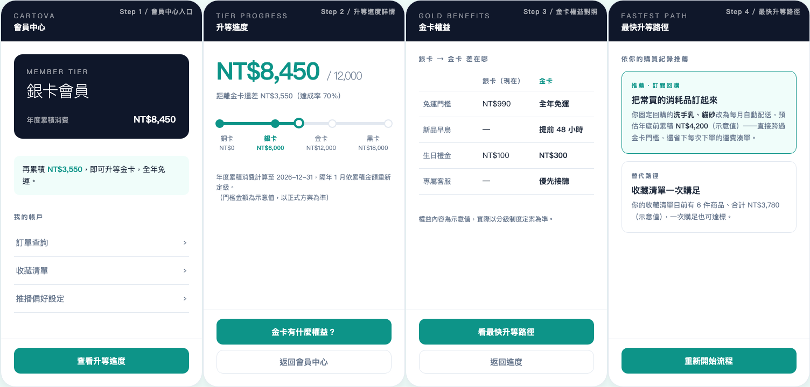

# pm-almighty-box

**A portable AI arsenal for product managers, built on Claude Code skills.** The engine never changes — you drop in one *context pack* per company, and every output (decision analysis, BRD/PRD, clickable prototype, demo video) speaks that company's strategy, metrics, brand CI, and *your* decision principles.

[繁體中文版 README](README.zh-TW.md)

---

## The four skills

| Pillar | Skill | Eats | Produces |
|---|---|---|---|
| **Decision assessment** | `pm-assess` | A proposal (or competing initiatives) + context pack (strategy / metrics / rubric) | Structured evaluation (impact / cost / strategic fit / risk), priority ranking, technical-option flags, one-line recommendation |
| **Proposal doc suite** | `pm-propose` | A decided initiative + context pack | BRD → PRD in two flavors (human-readable HTML + AI-dev markdown) + a presentable HTML report — all in company CI |
| **Prototype generator** | `pm-prototype` | A feature/flow description + brand tokens | Clickable in-browser HTML wireframe, mobile-frame first, company CI |
| **Demo video generator** | `pm-demo` | A prototype HTML or screenshots + brand tokens | 30–60s branded MP4 demo animation (optional GIF) — more persuasive than a static prototype |

The four skills are deliberately **silos**, not a pipeline — a PM's day is ad-hoc tasks on demand, not a fixed assembly line.

## What the output looks like

A `pm-prototype` run against the bundled demo context pack — *"用 pm-prototype 做一個「會員升等進度頁」的可點擊 prototype"* — produces this 4-screen clickable flow (member home → tier progress → benefits comparison → fastest-path recommendation), every color traceable to `brand-tokens.css`:



Click through it yourself: [`examples/cartova-member-tier-prototype.html`](examples/cartova-member-tier-prototype.html) (single self-contained file — download and open in any browser).

## Architecture: engine vs. context

```
pm-almighty-box/
├── skills/            ← ENGINE: generic logic, shared across companies
│   ├── pm-assess/  pm-propose/  pm-prototype/  pm-demo/
│   └── shared/        HTML craft rules + verification & export toolchain
├── contexts/
│   └── cartova/       ← CONTEXT PACK: one per company (demo pack included)
├── templates/         blank context-pack skeleton (7 files)
└── install.sh         install + hash-manifest upgrade protection
```

The moat lives in the **context pack** — especially `rubric.md`, where you write your own product-judgment principles as quotable criteria. Without it, any AI tool produces generic PM advice; with it, outputs argue from *your* judgment ("retention before acquisition", "no growth metric ships without a counter-metric").

## Demo context pack: Cartova

`contexts/cartova/` is a complete, **fully fictional** demo company — a mid-size curated-lifestyle e-commerce whose strategy centers on CRM and customer lifecycle management (winning the shift from paid acquisition to retention: lifecycle journeys, membership tiers, subscribe & save). All seven files are filled in, so you can clone this repo and exercise every skill immediately:

```
用 pm-assess 評估：會員分級制度 vs 沉睡喚醒旅程，先做哪個？
→ structured assessment citing Cartova's rubric ("time-window priority",
  "counter-metric discipline"), ranked recommendation, flagged stale metrics

用 pm-propose 幫「會員分級制度」寫 BRD 和 PRD
→ BRD keyed to each stakeholder's fears/priorities, dual-format PRD,
  presentation-ready HTML report — all in Cartova teal CI

用 pm-prototype 做一個「會員升等進度頁」的可點擊 prototype
→ single self-contained HTML, 375px mobile frame, click-through screens,
  every hex traceable to brand-tokens.css

用 pm-demo 幫「會員升等進度頁」做一支 30 秒 demo 影片
→ 1920×1080 MP4: CI title card → screen-by-screen walkthrough → value close
```

## Output quality gates

HTML outputs pass three gates beyond strict-CI mode:

- **Craft rules** (`skills/shared/html-craft.md`) — type-weight hierarchy, three orders of spatial magnitude, single-accent discipline, an anti-AI-slop blacklist, and a falsifiable four-question craft self-check. Raises the floor from "AI average" to "someone designed this".
- **Verification loop** (`skills/shared/scripts/verify.py`) — every HTML deliverable is Playwright-rendered, screenshotted, and console-error-checked before handoff; if verification didn't run, the skill says so instead of pretending.
- **Optional exports** — vector PDF (`html2pdf.mjs`) for reports/BRD/PRD; deck→editable PPTX toolchain included.

Craft methodology and toolchain are distilled from [huashu-design](https://github.com/alchaincyf/huashu-design) (alchaincyf, MIT License).

## Install

```bash
# Install skills to ~/.claude/skills/ (hash-manifest protection:
# locally modified files are never overwritten without --force)
./install.sh --user

# Seed a blank context pack for a new company
./install.sh --seed-context contexts/<your-company>
```

## Onboarding a new company

1. `./install.sh --user` — the four skills (+ shared toolchain) land in `~/.claude/skills/`
2. `./install.sh --seed-context contexts/<company>` — lays down the 7-file skeleton
3. Fill in strategy / metrics / product / stakeholders / brand CI — and above all **`rubric.md`**, your judgment layer. Use `contexts/cartova/` as the reference for what "filled in well" looks like.

That's the whole point: change companies, keep the arsenal.

## Regression testing

`tests/test-prompts.json` holds behavioral regression prompts — after editing any skill, replay them against the Cartova context and check outputs against the expected mechanisms. `tests/test-install.sh` covers the installer.

## License

[MIT](LICENSE) — bundled toolchain from huashu-design retains its MIT attribution.
